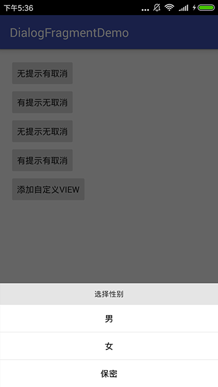
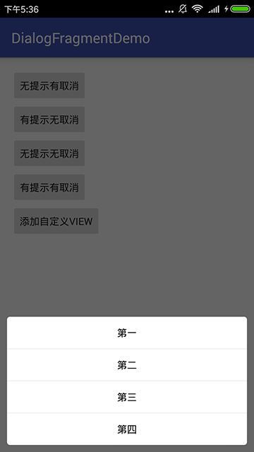

# DialogFragmentDemo

 
 
 
 
 

无论是`方角`、`圆角`，或者有`提示`有`取消`或者`自定义View`，各种颜色背景字体大小都可以通过代码控制，使用方法：

## gradle:

```groovy
dependencies {
    ...
    compile 'sing.bottomdialog:library:1.0.1'
}
```
## Maven:

```xml
<dependency>
　　<groupId>sing.bottomdialog</groupId>
　　<artifactId>library</artifactId>
　　<version>1.0.1</version>
　　<type>pom</type>
</dependency>
```

本文是通过DialogFragment来实现的底部弹窗，所以必须传入`FragmentManager`，采用Builder模式进行设置，`.build()`之后会自动弹出，当点击之后不会自动消失，会在监听里返回该Dialog对象，需要自己`dismiss`,下面是所属属性：

属性 | 解释
---- | ----
context | 上下文对象
f | FragmentManager对象（必须传）
cancel | 取消按钮显示的文字，不设置就没有该项
hint | 头部提示部分的文字，不设置就没有该项
list | List<String> 中间部分的文字
isRect | true,代表没有圆角
radius | 四周圆角弧度，isRect为true时无效
hintBgColor | 提示部分的背景颜色
hintTextColor | 提示部分的文字颜色
hintTextSize | 提示部分的文字大小
fillColor | 中间部分填充颜色
pressColor | 中间部分按下颜色
strokeColor | 没项之间的分割线颜色
cancelTextColor | 取消项的文字颜色
cancelTextSize | 取消项的文字大小
textSize | 中间部分的文字大小
textColor | 中间部分的文字颜色
view | 添加的自定义的View
position | 添加自定义的View的位置
listener | 点击监听，返回 dialog对象，pos所在list的位置, str点击项的文字

无提示有取消：

```JAVA
new BottomDialog.Builder(MainActivity.this)
                        .setFragmentManager(getSupportFragmentManager())
                        .setCancel("取消")
                        .setCancelTextColor(Color.parseColor("#FF0000"))
                        .setCancelTextSize(16)
                        .setList(new String[]{"拍照", "从相册中选择"})
                        .setListener(MainActivity.this)
                        .build();
```
有提示无取消

```JAVA
new BottomDialog.Builder(MainActivity.this)
                        .setFragmentManager(getSupportFragmentManager())
                        .setHint("选择性别")
                        .setIsRect(true)
                        .setHintTextSize(12)
                        .setHintTextColor(Color.parseColor("#313131"))
                        .setHintBgColor(Color.parseColor("#E5E5E5"))
                        .setList(new String[]{"男", "女", "保密"})
                        .setListener(MainActivity.this)
                        .build();
```
无提示无取消

```JAVA
new BottomDialog.Builder(MainActivity.this)
                        .setFragmentManager(getSupportFragmentManager())
                        .setList(new String[]{"第一", "第二", "第三", "第四"})
                        .setListener(MainActivity.this)
                        .build();
```
有提示有取消

```JAVA
new BottomDialog.Builder(MainActivity.this)
                        .setFragmentManager(getSupportFragmentManager())
                        .setHint("退出后将情况记录")
                        .setHintBgColor(Color.parseColor("#E5E5E5"))
                        .setHintTextSize(12)
                        .setHintTextColor(Color.parseColor("#313131"))
                        .setCancel("取消")
                        .setCancelTextSize(16)
                        .setCancelTextColor(Color.parseColor("#FF0000"))
                        .setIsRect(true)
                        .setList(new String[]{"男", "女", "保密"})
                        .setListener(MainActivity.this)
                        .build();
```
添加了自定义View

```JAVA
View view = LayoutInflater.from(MainActivity.this).inflate(R.layout.dialog_title,null);
                view.findViewById(R.id.cancel).setOnClickListener(MainActivity.this);
                view.findViewById(R.id.ok).setOnClickListener(MainActivity.this);
                new BottomDialog.Builder(MainActivity.this)
                        .setFragmentManager(getSupportFragmentManager())
                        .setView(view,0)
                        .setIsRect(true)
                        .setList(new String[]{"选项一", "选项二", "选项三"})
                        .setListener(MainActivity.this)
                        .build();
```
         